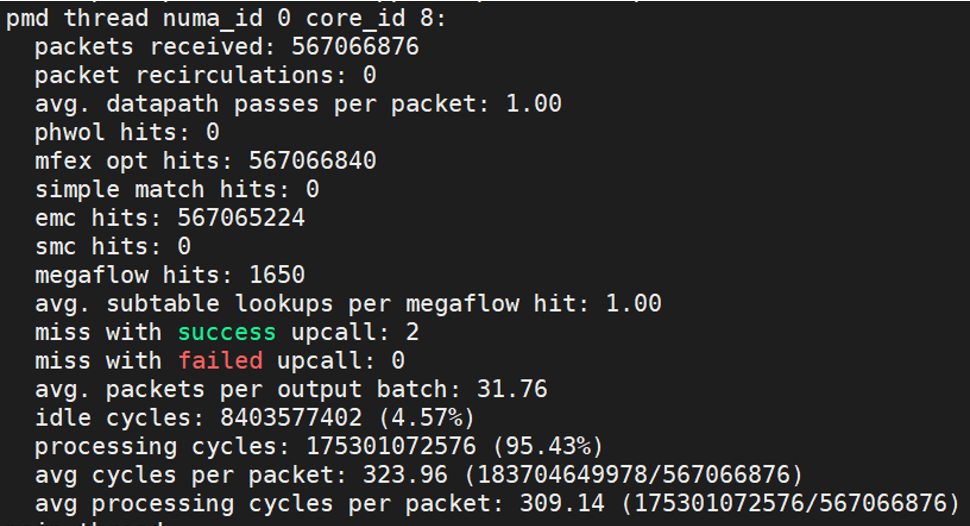
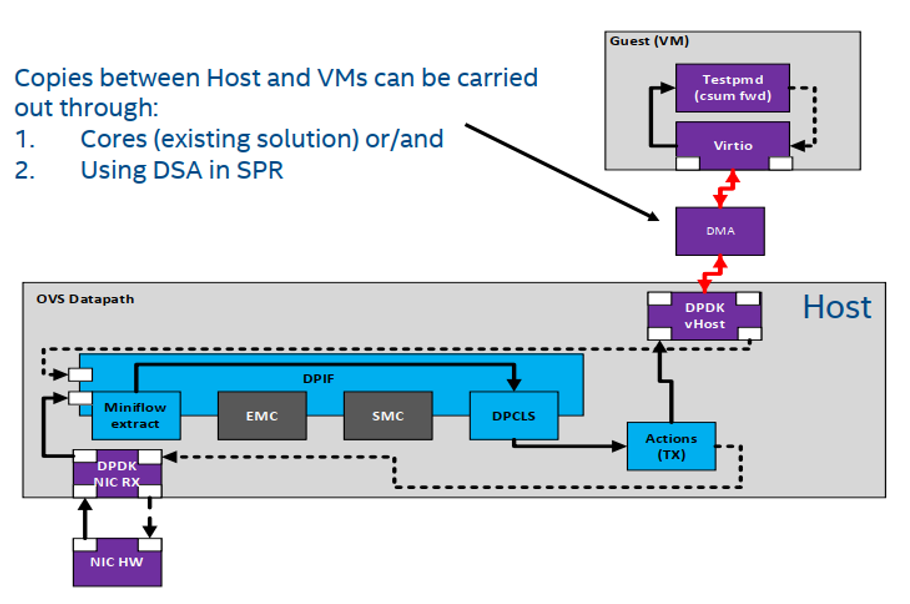

# OVS-DPDK DSA Experience Guide for 4th Generation Intel® Xeon® Scalable Processors 

## Introduction

This guide is for users who are already familiar with OVS-DPDK DSA Experience Guide.  It provides recommendations for configuring hardware and software that will provide the best performance in most situations. However, please note that we rely on the users to carefully consider these settings for their specific scenarios, since OVS and DPDK can be deployed in multiple ways. 
	
[Open vSwitch](https://www.openvswitch.org/) is a multilayer software switch for monitoring, queuing, and shaping network traffic It can be used for VLAN isolation and traffic filtering.  It is well-suited to function as a virtual switch in VM environments.  [DPDK](https://www.dpdk.org/) is the Data Plane Development Kit used to accelerate packet processing workloads.  

*(Describe pre-requisites)*
	
4th Generation Intel® Xeon® Scalable processors lead the industry in delivering workload-optimized platforms with built-in AI acceleration.  They provide seamless performance to speed the transformative impact of data from the intelligent edge to the multi-cloud. Improvements of particular interest to this workload are: 

- Enhanced Performance
- Enhanced Intel® Deep Learning Boost with VNNI
- More Intel® Ultra Path Interconnect
- Increased DDR4 Memory Speed & Capacity
- Intel® Advanced Vector Extensions
- Intel® Security Essentials and Intel® Security Libraries for Data Center 
- Intel® Speed Select Technology
- Support for Intel® Optane™ Persistent Memory 200 series


Tested hardware and software for this tuning guide include:

### Server Configuration

#### Hardware

The configuration described in this article is based on 4th Generation Intel® Xeon® processor hardware. The server platform, memory, hard drives, and network interface cards can be determined according to your usage requirements.

| Hardware | Model |
|----------------------------------|------------------------------------|
| Server Platform Name/Brand/Model | Intel® Server System  |
| CPU | Intel® Xeon® ???  | 
| BIOS | version # ???| 
| Memory | ??? | 
| Storage/Disks | ??? | 
| NIC (if it applies) | Intel® Ethernet Controller ??? | 

#### Software

| Software | Version |
|------------------|-------------|
| Operating System | Linux Debian/ubuntu or RHEL/Centos  | 
| Kernel | 5.15.0-18-generic | 

			
## Hardware Tuning

*(Enter any other information on general system setup and tuning.)*

### BIOS Settings

*(Use this section to describe BIOS settings that should be changed in order to improve workload performance.)*

Begin by resetting your BIOS to default setting, then follow the suggestions below for changes to the default:

| Configuration Item | Recommended Value
|---------------------|------------------|
| Advanced/Power & Performance/CPU P State Control/CPU P State Control/Enhanced Intel SpeedStep® Tech | ??? |
| Advanced/Power & Performance/CPU Power and Performance Policy | ??? |
| Advanced/Memory Configuration/SNC (Sub-NUMA Clusters) | ??? |
| Advanced/Memory Configuration/Page Policy | ??? |
| Advanced/UPI Configuration/XPT Prefetch | ??? |
| Advanced/Processor Configuration/Direct-to-UPI (D2K) | ??? |

If no specific settings apply, then use this text: (No specific BIOS setting for this this workload – just use the defaults)

*If you recommend a BIOS setting, give an explanation of what the setting does and why it matters to the workload.  Here is an example from the HPC Cluster Tuning Guide:*

### Description of Settings *(Update or remove any of these)*

#### Sub-NUMA Cluster (SNC) 

SNC is a feature that provides similar localization benefits as Cluster-On-Die (COD), a feature found in previous processor families, without some of COD’s downsides. SNC breaks up the last level cache (LLC) into disjoint clusters based on address range, with each cluster bound to a subset of the memory controllers in the system. SNC improves average latency to the LLC and is a replacement for the COD feature found in previous processor families.

#### Direct-to-UPI (D2K)

D2U is a latency-saving feature for remote read transactions. With D2U enabled, the IMC will send the data directly to the UPI instead of going through the Caching and Home Agent (CHA), reducing latency. Keep enabled, although workloads that are highly NUMA-optimized or that use high levels of memory bandwidth are less likely to be affected by disabling D2U.

#### XPT (eXtended Prediction Table) Prefetch

Extended prediction table (XPT) Prefetch is a new capability that is designed to reduce local memory access latency. XPT Prefetch is an “LLC miss predictor” in each core that will issue a speculative DRAM read request in parallel to an LLC lookup, but only when XPT predicts a “miss” from the LLC lookup.
For more information, refer to the BIOS Setup Utility User Guide for the Intel® Server Board D50TNP and M50CYP Family.

### Memory Configuration/Settings

(Use this section to describe the optimum memory configuration.  Here are some questions to consider:  How many DIMMS per channel?  How many channels are used?  Is PMem appropriate for this workload?  If so how should it be configured?)

Example: At least 1 DIMM per memory channel needs to be populated. Lower cpu-utilization could be an issue if there are no DIMMs in a memory channel because of the contention from database cache.

If no specific settings apply, then use this text: (No specific workload setting)

### Storage/Disk Configuration/Settings

*(Are there any specific settings or recommendations for storage media?)*

If no specific suggestions apply, then use this text: (No specific workload setting)

### Network Configuration/Setting

*(Are there any specific settings or recommendations for the network setup?  Does your workload use multiple systems? Any advice on how many clients? For example, how much CPU and memory will they need and how they should it be setup?).* 

*If no specific suggestions apply, then use this text: (No specific workload setting for this topic)*

## Software Tuning 

Software configuration tuning is essential.  The general purpose, default settings are almost never yield the best performance for specialized workloads.

### Linux Kernel Optimization Settings

The 5.15.0-18-generic kernel is recommended along with setting the uncore frequency to max. For example, set it to 2.3 GHZ:  ```wrmsr -a 0x620 0x1717``` 
To ensure the setting is working, run ```rdmsr 0x621``` to check the uncore frequency.  It should return ```xxxx0017```, where ```17``` represents 2.3 GHZ. Read more details [here](https://stackoverflow.com/questions/66084371/reading-current-uncore-frequency-and-setting-uncore-frequency-multipliers).

In addition, Linux boot parameters are also listed below:

*this must be text rather than an image*


### OVS-DSA Architecture

The OVS-DSA ??? *an architecture diagram would be great*

#### DPDK

The DPDK repo is located at: https://github.com/istokes/dpdk/tree/dma-tracking.  Use the dma-tracking branch with base commit: lib/vhost: Add poll factor for DMA (8897104f0a04)

Build DPDK

```
export DPDK_DIR=path/to/dpdk
meson --prefix=$(pwd)/build build
ninja -C build install
export DPDK_INSTALL=$DPDK_DIR/build
```

Export PKG_CONFIG_PATH for Debian/ubuntu

```
export PKG_CONFIG_PATH=$DPDK_INSTALL/lib/x86_64-linux-gnu/pkgconfig/:$PKG_CONFIG_PATH
```

Export PKG_CONFIG_PATH for RHEL/Centos

```
export PKG_CONFIG_PATH=$DPDK_INSTALL/lib64/pkgconfig/:$PKG_CONFIG_PATH
```

Check the DPDK installation

```
pkg-config --modversion libdpdk    # should print: 22.07-rc0
pkg-config --cflags libdpdk        # should print path to installed DPDK
```

#### Open vSwitch (OVS)

The OVS repo is located at: https://github.com/istokes/ovs/tree/dpdk-dma-tracking.  Use the dpdk-dma-tracking branch with the base commit: ci: Enable builds to test with dependent DSA branches (5df6f9398420)

After building DPDK, then build OVS:

```
./boot.sh
./configure CFLAGS="-g -Ofast -march=native"  --with-dpdk=static
make -j32 && make install
```

### DSA Performance Validation

Before OVS-DPDK DSA experiments, we suggest validating DSA hardware performance first. A single DSA instance can achieve ~30GB copy throughput. The recommended tool is DSA_MICRO, and here is the link https://github.com/intel/dsa-perf-micros .


### DSA Driver
Linux kernel and DPDK provide DSA driver (kernel IDXD driver and DPDK vfio-pci driver), and both can be used in OVS-DPDK DSA experiments. No matter which driver is used, DPDK DMA library is used in data-path to offload copies to DSA, and the only difference is which driver configures DSA.

The recommended driver is kernel IDXD since it is more flexible. To use IDXD, DSA instances must be bound to IDXD driver, and users need to configure Work Queue (WQ) explicitly. And OVS-DPDK DSA uses dedicated WQ. 

Here are two ways of configuring WQ:

1.	Use accel-config, and the link is https://01.org/blogs/2020/pedal-metal-accelerator-configuration-and-control-open-source . Here is an example to set up one WQ for one DSA instance with using four Engines:

```
dpdk/usertools/dpdk-devbind.py -b idxd 0000:6a:01.0
accel-config disable-device dsa0
accel-config config-engine dsa0/engine0.0 --group-id=0
accel-config config-engine dsa0/engine0.1 --group-id=0
accel-config config-engine dsa0/engine0.2 --group-id=0
accel-config config-engine dsa0/engine0.3 --group-id=0
accel-config config-wq dsa0/wq0.0 --group-id=0 --mode=dedicated --priority=10 --wq-size=128 --type=user --name=dpdk_ovs --ats-disable 1
accel-config enable-device dsa0
accel-config enable-wq dsa0/wq0.0
accel-config list
```

In the command above, we create one WQ, wq0.0, which has 128 batch descriptors (the MAX in one DSA instance). In addition, we disable ATS for wq0.0, and this is for higher address translation efficiency.

2.	Use DPDK idxd script also supports to create dedicated WQ. Here is an example of create one WQ for DSA instance 0:

```
/*reset wq when need operate idxd device if the WQ existed*/
$dpdk_dir/drivers/dma/idxd/dpdk_idxd_cfg.py --reset 0
/*create one WQ for DSA instance 0*/
$dpdk_dir/drivers/dma/idxd/dpdk_idxd_cfg.py -q 1 0
```

With #1 or #2 above, dedicated WQs can be created. Then VHOST uses DPDK DMA device library APIs to offload packet copies to WQs. Note that DPDK represents one WQ as a DMA device, with a unique DMA device ID. 

Using IDXD driver is recommended, but for simplicity, users can also use vfio-pci. Below is an example, where DPDK DMA device will create one and eight DMA device for DSA instance 0000:6a:01.0. The value of “max_queues” is 1~8:

```
/* create one DMA device, each has 128 batch descriptors */
$dpdk-test -l 4 -a 0000:6a:01.0,max_queues=1
/* create eight DMA devices, each has 16 batch descriptors */
$dpdk-test -l 4 -a 0000:6a:01.0,max_queues=8
```

### OVS-DPDK DSA

The command to enable DSA acceleration is list below:

```
$ovs-vsctl --no-wait set Open_vSwitch . other_config:vhost-async-support=true
```

With the above command, all PMD threads will use DSA acceleration. We call DSA accelerated data-path as asynchronous data-path and SW data-path as synchronous data-path. OVS-DPDK allocates DMA devices to every PMD thread. That is, every PMD thread has dedicated DMA devices and no DMA device sharing among PMD threads.

In addition, current OVS-DPDK doesn’t support some PMD threads use asynchronous data-path, but others don’t. Therefore, users must guarantee that the number of DSA WQs is greater than or equal to the number of PMD threads. For example, if OVS-DPDK has eight PMD threads, we need to create eight DSA WQs at least and each PMD thread will have one dedicated DSA WQ. Note that if the number of WQs are greater than that of PMD threads, one PMD thread only uses one WQ.

### Performance Tuning

There are several factors impacting DSA performance.

#### Batching

Batching is a key factor to achieve high copy performance for DSA. Usually, for better utilizing DSA, the copy batching size needs to be greater than or equal to 16.

For OVS-DPDK, the burst size in each vhost enqueue/dequeue operation is usually 32, and the DSA copy batching size is greater than or equal to 32 in this case. However, in real world cases, the burst size can be much less than 16, like 6 packets per enqueue operation. The small batching will hurt OVS-DPDK DSA performance significantly.

To mitigate the impact from small batching, there are two recommended methods:

1. Set TX flush interval in OVS-DPDK for batching before enqueue. Note that this feature also increases latency. For more details, please refer to:  https://docs.openvswitch.org/en/latest/intro/install/dpdk/#output-packet-batching. For example, set it to 50 microseconds for 8 Core && 32VM case:

```
$ovs-vsctl set Open_vSwitch . other_config:tx-flush-interval=50
```

2)	Configure traffic generator to have enough packets per enqueue operation.

#### Address Translation

DSA supports to use VA as copy address (both source and destination). The address translation is done by ATS in DSA and platform IOMMU. For better address translation efficiency, we recommend disabling ATS for every WQ. Note that only IDXD supports disabling ATS. Please refer “DSA Work Queue Configuration” section. In addition, 1G huge page is recommended for both OVS-DPDK and VM.

#### AVX512

OVS has integrated with Intel AVX512 instruction to accelerate data path operations. Therefore, we recommend using it for higher forwarding performance. Here are commands:

```
#Before launching vswitchd:
$ovs-vsctl --no-wait set Open_vSwitch . other_config:dpdk-extra="--force-max-simd-bitwidth=512"

#After launch vswitchd:
$ovs-appctl dpif-netdev/miniflow-parser-set study
$ovs-appctl dpif-netdev/dpif-impl-set dpif_avx512
$ovs-appctl dpif-netdev/subtable-lookup-prio-set avx512_gather 3
```

Note that if your board is dual-socket or multi-socket, please guarantee all used cores, DSA instances and memory locate in the same NUMA node. Furthermore, from experience, we recommended using dynamic memory, rather than legacy memory for OVS-DPDK.

### Performance Indicator

OVS-DPDK DSA (i.e., OVS-DPDK with using DSA) can either achieve higher packet forwarding rate or save CPU cycles than baseline OVS-DPDK (i.e., CPU copy packets). There are two kinds of tests to verify the improvement of packet forwarding rate:

1.	Baseline and OVS-DPDK DSA have same core number, OVS-DPDK DSA uses extra DSA instances.
2.	With same throughput of Baseline and OVS-DPDK DSA, check how many cores that OVS-DPDK DSA can save.

To check saved CPU cycles, a sample command listed below can be used:

```
ovs-appctl dpif-netdev/pmd-stats-clear && ovs-appctl dpif-netdev/pmd-stats-show
```

Here is an example screenshot, where “idle cycles” represents saved CPU cycles:



### Example 1 – 1Core-1VHOST Port PVP

Experiment topology is listed below. There are two ports, one is physical port, and another is vhost port. The physical port is used to connect with traffic generator, and the vhost port is used to connect guest.
 


To run the test, please follow the following four steps.

1.	Bind DSA instance 0000:6a:01.0 to IDXD and create one dedicated WQ for it:

```
dpdk/usertools/dpdk-devbind.py -b idxd 0000:6a:01.0
accel-config disable-device dsa0
accel-config config-engine dsa0/engine0.0 --group-id=0
accel-config config-engine dsa0/engine0.1 --group-id=0
accel-config config-engine dsa0/engine0.2 --group-id=0
accel-config config-engine dsa0/engine0.3 --group-id=0
accel-config config-wq dsa0/wq0.0 --group-id=0 --mode=dedicated --priority=10 --wq-size=128 --type=user --name=dpdk_ovs --ats-disable 1
accel-config enable-device dsa0
accel-config enable-wq dsa0/wq0.0
accel-config list
```

2.	OVS Commands:

```
        NIC=0000:4a:00.1
DB_SOCK=/usr/local/var/run/openvswitch/db.sock
rm -rf /usr/local/var/run/openvswitch/
mkdir -p /usr/local/var/run/openvswitch/
rm -rf /usr/local/etc/openvswitch/
mkdir -p /usr/local/etc/openvswitch/
rm -f /usr/local/etc/openvswitch/conf.db

pkill ovs -9

ovsdb-tool create /usr/local/etc/openvswitch/conf.db ./vswitchd/vswitch.ovsschema
ovsdb-server --remote=punix:$DB_SOCK --remote=db:Open_vSwitch,Open_vSwitch,manager_options &
sleep 3
ovs-vsctl --no-wait init
ovs-vsctl --no-wait set Open_vSwitch . other_config:dpdk-init=true
ovs-vsctl --no-wait set Open_vSwitch . other_config:dpdk-socket-mem="8192,0"
ovs-vsctl --no-wait set Open_vSwitch . other_config:dpdk-hugepage-dir="/dev/huge1G0"
ovs-vsctl --no-wait set Open_vSwitch . other_config:dpdk-lcore-mask="0x10"
ovs-vsctl --no-wait set Open_vSwitch . other_config:pmd-cpu-mask="0x100"
# To configure DPDK libraries to use AVX-512 instruction set
ovs-vsctl --no-wait set Open_vSwitch . other_config:dpdk-extra="-n 8 --file-prefix=dpdk_ovs --force-max-simd-bitwidth=512"

rm -rf /tmp/ovs.log
ovs-vswitchd --pidfile --mlockall --log-file=/tmp/ovs.log &

# The following command is a must for enabling DSA.
# You can check if Async data-path is enabled in ovs.log file
# e.g.,” DMA device with dev id: 0 assigned to pmd for vhost async copy offload”
ovs-vsctl --no-wait set Open_vSwitch . other_config:vhost-async-support=true

# To configure max-idle timeout for flows
ovs-vsctl set Open_vSwitch . other_config:max-idle=30000

ovs-vsctl del-br br1
ovs-vsctl add-br br1 -- set Bridge br1 datapath_type=netdev
ovs-vsctl add-port br1 phy0 -- set Interface phy0 type=dpdk options:dpdk-devargs=$NIC ofport_request=1
sleep 1;

ovs-vsctl add-port br1 vhost-user1 -- set Interface vhost-user1 type=dpdkvhostuserclient options:vhost-server-path=/tmp/sock0
ovs-vsctl set Interface vhost-user1 options:tx-retries-max=0
sleep 1;

ovs-ofctl del-flows br1
sleep 1;
ovs-ofctl add-flow br1 in_port=2,action=output:1
ovs-ofctl add-flow br1 in_port=1,action=output:2
ovs-vsctl set Open_vSwitch . other_config:pmd-perf-metrics=false
ovs-vsctl list Open_vSwitch

#echo "------------Enabling AVX512 on the OVS datapath------------"
ovs-appctl dpif-netdev/dpif-impl-set dpif_avx512
ovs-appctl dpif-netdev/subtable-lookup-prio-set avx512_gather 3
ovs-appctl dpif-netdev/miniflow-parser-set study
```

3.	Start another testpmd process with virtio-user as front-end, and run in csumfwd mode:

```
dpdk-testpmd -l 20-24 -n 4 --socket-mem 2048,0 --no-pci --file-prefix=virtio \
--huge-dir=/dev/huge1G1 --no-pci \
--vdev "net_virtio_user0,mac=00:11:22:33:44:10,path=/tmp/sock0,queues=1,queue_size=2048,server=1,in_order=1" \
-- -i --mbuf-size=2048 --txq=1 --rxq=1 --nb-cores=1 --txd=2048 --rxd=2048
```

Alternatively, we can launch a VM and run testpmd inside VM. And sample QEMU script is below:

```
taskset -c 10-11,74-75  /root/ovs-dpdk/qemu/build/qemu-system-x86_64 -m 4G -smp 4,cores=4,threads=1,sockets=1 -cpu host -drive format=qcow2,file=$vm  -boot c -enable-kvm -name $vm_name \
-object memory-backend-file,id=mem,size=4G,mem-path=/dev/huge1G1,share=on -numa node,memdev=mem -mem-prealloc \
-netdev user,id=nttsip,hostfwd=tcp::2023-:22 \
-device e1000,netdev=nttsip \
-chardev socket,id=char1,path=/tmp/sock0,server=on \
-netdev type=vhost-user,id=net1,chardev=char1,vhostforce=on -device virtio-net-pci,netdev=net1,mac=00:01:00:00:00:01,csum=off,gso=off,guest_tso4=off,guest_tso6=off,guest_ecn=off,mrg_rxbuf=on \
-monitor telnet:127.0.0.1:1001,server,nowait -vnc :0
```

4.	Inject TCP/IPv4 packets with 1M different DST IP from traffic generator.

Example 2 – 4Cores-4Vhost Ports PVP

To run the test, please follow the following four steps.

1.	Bind DSA instance 0000:6a:01.0 to IDXD and create four dedicated WQ:

```
dpdk/usertools/dpdk-devbind.py -b idxd 0000:6a:01.0

accel-config disable-device dsa0
accel-config config-engine dsa0/engine0.0 --group-id=0
accel-config config-engine dsa0/engine0.1 --group-id=0
accel-config config-engine dsa0/engine0.2 --group-id=0
accel-config config-engine dsa0/engine0.3 --group-id=0

accel-config config-wq dsa0/wq0.0 --group-id=0 --mode=dedicated --priority=10 --wq-size=32 --type=user --name=dpdk_ovs --ats-disable 1
accel-config config-wq dsa0/wq0.1 --group-id=0 --mode=dedicated --priority=10 --wq-size=32 --type=user --name=dpdk_ovs --ats-disable 1
accel-config config-wq dsa0/wq0.2 --group-id=0 --mode=dedicated --priority=10 --wq-size=32 --type=user --name=dpdk_ovs --ats-disable 1
accel-config config-wq dsa0/wq0.3 --group-id=0 --mode=dedicated --priority=10 --wq-size=32 --type=user --name=dpdk_ovs --ats-disable 1

accel-config enable-device dsa0
accel-config enable-wq dsa0/wq0.0
accel-config enable-wq dsa0/wq0.1
accel-config enable-wq dsa0/wq0.2
accel-config enable-wq dsa0/wq0.3

accel-config list
```

2.	OVS Commands:

```
       NIC=0000:4a:00.1
DB_SOCK=/usr/local/var/run/openvswitch/db.sock
rm -rf /usr/local/var/run/openvswitch/
mkdir -p /usr/local/var/run/openvswitch/
rm -rf /usr/local/etc/openvswitch/
mkdir -p /usr/local/etc/openvswitch/
rm -f /usr/local/etc/openvswitch/conf.db

pkill ovs -9

ovsdb-tool create /usr/local/etc/openvswitch/conf.db ./vswitchd/vswitch.ovsschema
ovsdb-server --remote=punix:$DB_SOCK --remote=db:Open_vSwitch,Open_vSwitch,manager_options &
sleep 3
ovs-vsctl --no-wait init
ovs-vsctl --no-wait set Open_vSwitch . other_config:dpdk-init=true
ovs-vsctl --no-wait set Open_vSwitch . other_config:dpdk-socket-mem="8192,0"
ovs-vsctl --no-wait set Open_vSwitch . other_config:dpdk-hugepage-dir="/dev/huge1G0"
ovs-vsctl --no-wait set Open_vSwitch . other_config:dpdk-lcore-mask="0x20"
ovs-vsctl --no-wait set Open_vSwitch . other_config:pmd-cpu-mask="0x1E"
# To configure DPDK libraries to use AVX-512 instruction set
ovs-vsctl --no-wait set Open_vSwitch . other_config:dpdk-extra="-n 8 --file-prefix=dpdk_ovs --force-max-simd-bitwidth=512"

rm -rf /tmp/ovs.log
ovs-vswitchd --pidfile --mlockall --log-file=/tmp/ovs.log &

# The following command is a must for enabling DSA.
# You can check if Async data-path is enabled in ovs.log file
# e.g., “DMA device with dev id: 0 assigned to pmd for vhost async copy offload”
#            “DMA device with dev id: 1 assigned to pmd for vhost async copy offload.”
#           “DMA device with dev id: 2 assigned to pmd for vhost async copy offload”
#          “DMA device with dev id: 3 assigned to pmd for vhost async copy offload.”

ovs-vsctl --no-wait set Open_vSwitch . other_config:vhost-async-support=true

# To configure max-idle timeout for flows
ovs-vsctl set Open_vSwitch . other_config:max-idle=30000

ovs-vsctl del-br br1
ovs-vsctl add-br br1 -- set Bridge br1 datapath_type=netdev

# Add nic port with 4 queues
ovs-vsctl add-port br1 phy0 -- set Interface phy0 type=dpdk options:dpdk-devargs=$NIC ofport_request=1 options:n_rxq=4 other_config:pmd-rxq-affinity="0:1,1:2,2:3,3:4"
 
# Add four vhost ports with 
for i in {1..4}
do
    temp=$[i]
    ovs-vsctl add-port br1 vhost-user$i -- set Interface vhost-user$i type=dpdkvhostuserclient options:vhost-server-path=/tmp/sock$i
    ovs-vsctl set Interface vhost-user$i options:tx-retries-max=0
done
ovs-vsctl set Interface vhost-user1 other_config:pmd-rxq-affinity="0:1"
ovs-vsctl set Interface vhost-user2 other_config:pmd-rxq-affinity="0:2"
ovs-vsctl set Interface vhost-user3 other_config:pmd-rxq-affinity="0:3"
ovs-vsctl set Interface vhost-user4 other_config:pmd-rxq-affinity="0:4"
sleep 1;

ovs-ofctl del-flows br1
sleep 1;
for i in {2..5}
do
    ovs-ofctl add-flow br1 idle_timeout=0,in_port=1,ip,nw_src=1.1.1.$i,action=output:$i
    ovs-ofctl add-flow br1 idle_timeout=0,in_port=$i,action=output:1
done

ovs-vsctl set Open_vSwitch . other_config:pmd-perf-metrics=false
ovs-vsctl list Open_vSwitch

#echo "-------------Enabling AVX512 on the OVS datapath------------"
ovs-appctl dpif-netdev/dpif-impl-set dpif_avx512
ovs-appctl dpif-netdev/subtable-lookup-prio-set avx512_gather 5
ovs-appctl dpif-netdev/miniflow-parser-set study
```

3.	Start another testpmd process with virtio-user as front-end, and run in csumfwd mode:

```
dpdk-testpmd -l 19-23 -n 4 --socket-mem 2048,0 --no-pci --file-prefix=virtio \
--huge-dir=/dev/huge1G1 --no-pci \
--vdev "net_virtio_user1,mac=00:11:22:33:44:11,path=/tmp/sock1,queues=1,queue_size=2048,server=1,in_order=1" \
--vdev "net_virtio_user2,mac=00:11:22:33:44:12,path=/tmp/sock2,queues=1,queue_size=2048,server=1,in_order=1" \
--vdev "net_virtio_user3,mac=00:11:22:33:44:13,path=/tmp/sock3,queues=1,queue_size=2048,server=1,in_order=1" \
--vdev "net_virtio_user4,mac=00:11:22:33:44:14,path=/tmp/sock4,queues=1,queue_size=2048,server=1,in_order=1" \
-- -i --mbuf-size=2048 --txq=1 --rxq=1 --nb-cores=4 --txd=2048 --rxd=2048

```

4.	Inject TCP/IPv4 packets with SRC IP are 1.1.1.2 to 1.1.1.5 and 1M different DST IP from traffic generator.


## Related Tools and Information (optional section)

In this section you can list tools that are related to the workload or solution such as performance monitoring/testing tools, or configuration checking tools, or platform utility tools. It is up to you if there are any tools you want to tell users about, listing appropriate code examples and screenshots.

## Best Practices for Testing and Verification (optional section)

In this section you can list any BKMs you have for running the workload. Example below is from the WorkPress Tuning Guide:

Example: Note that the recommendations in the guide for WordPress workload are only a reference, and the tunings here should be carefully adopted by someone who is well-versed with the workload and the system settings.

- Since this is a CPU-bound web front-end workload, when all the requests are appropriately distributed, we expect ~90+% CPU-utilization. Use tools like sar/htop to verify you get the expected CPU utilization.
- Execute at least 7 runs to ensure the standard deviation is within 5%.
- Restart MariaDB service after every run to clear query cache. This is specific to the workload and not a recommendation for the real-world web deployments.

## Conclusion

Use this section as a brief wrap-up for the guide. 

Example: We understand every application is unique. We shared many of our experiences with MySQL and PostgreSQL hoping that some of our learnings could be applied to your specific application. Both Open-Source relational database management systems have been well tested on Intel platforms. With 4th Generation Intel® Xeon® Scalable processor, Intel takes it even further by optimizing the platform as a whole -- CPU, memory, storage, and networking working together for the best user experience.

## Additional Resources (optional, as needed)

## References (optional, as needed)

## Feedback (required section)

We value your feedback. If you have comments (positive or negative) on this guide or are seeking something that is not part of this guide, please reach out and let us know what you think. 
 
